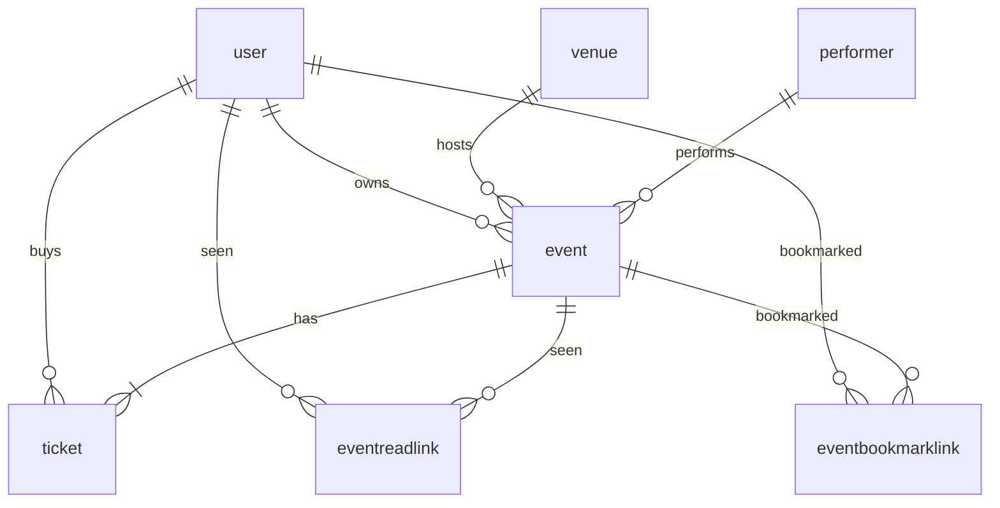

# Event schema design

**Date:** 2026-09-21

**Scope:** Replace the item model with events, venues, performers, and tickets. Adjust the existing item HTTP routes so they serve events. Do not add venue, performer, or ticket routes. Do not change the frontend client or Playwright tests in this step.

## Decisions

- `user` is unchanged.
- `item` becomes `event`. Primary keys stay UUIDs.
- An event keeps `owner_id` (the creator) and `created_at`. The owner or a superuser can update and delete. Deleting a user deletes the events they own.
- Seen and bookmark stay many-to-many links with the same behavior: opening an event marks it seen, and the current user can set or clear a bookmark.
- Creating an event writes one `AVAILABLE` ticket per seat from that venue's seat map. Every ticket stores the single `price` from the create payload. The buyer `user_id` is null.
- Seat coordinates are 0-based on both sides. For seat map `[4, 5, 5, 7]`, the 3rd seat in the 1st row is `(0, 2)`.
- `venue_id` and `price` are fixed after create. Updating them would disagree with tickets already issued.
- Existing item rows are discarded. They have no venue or performer, so they cannot become events.

## Schema

**venue.** `id`, `city`, `country`, `name` (each string, max 255), `seat_map` (Postgres integer array, required, at least one row). Each entry is that row's seat count and must be at least 1. `[4, 5, 5, 7]` is four rows: widths 4, 5, 5, and 7.

**performer.** `id`, `name` (max 255), `genre` (`MUSIC`, `SPORT`, `THEATRE`, `CIRCUS`), `description` (optional, max 255).

**event** (replaces `item`). `id`, `name` (replaces `title`, required, max 255), `description` (optional, max 255), `time` (timezone-aware datetime, required), `venue_id` (required), `performer_id` (required), `owner_id` (required), `created_at`.

**ticket.** `id`, `event_id` (required), `user_id` (optional buyer), `row` and `seat` (integers, both >= 0), `price` (float, >= 0), `availability` (`AVAILABLE` or `BOOKED`). Unique on `(event_id, row, seat)`.

**eventreadlink** and **eventbookmarklink** replace `itemreadlink` and `itembookmarklink`. Composite primary key `(user_id, event_id)`.

Foreign-key delete behavior:

- Deleting a user deletes the events they own. Those events delete their tickets and their seen and bookmark links.
- Deleting a user sets `ticket.user_id` to null on tickets they bought. The ticket row stays, and its `availability` stays as stored.
- Deleting an event deletes its tickets and its seen and bookmark links.
- Deleting a venue or a performer is blocked while any event still points at it.

## Endpoints

The router moves from `/items` to `/events`. Python models use `Event`, `Venue`, `Performer`, and `Ticket`. Ticket generation is one function shared by create and by seed data.

| Method | Path | Behavior |
| --- | --- | --- |
| `GET` | `/events/` | List events, newest `created_at` first. Includes seen and bookmark flags for the current user. Does not embed tickets. |
| `GET` | `/events/bookmarked` | Current user's bookmarked events. Same shape as the list, including `is_bookmarked: true`. |
| `GET` | `/events/{id}` | One event. Marks it seen for the current user. Embeds tickets: `id`, `row`, `seat`, `price`, `availability`, `user_id`. |
| `PUT` | `/events/{id}/bookmark` | Sets or clears the current user's bookmark. Body is `{ "is_bookmarked": bool }`. Returns the list shape, not the ticket list. |
| `POST` | `/events/` | Creates an event and its tickets. |
| `PUT` | `/events/{id}` | Updates `name`, `description`, `time`, `performer_id`. Owner or superuser. |
| `DELETE` | `/events/{id}` | Deletes the event. Owner or superuser. Tickets and links go with it. |

**Create body.** `name`, `description`, `venue_id`, `performer_id`, `time`, `price`. `owner_id` is the logged-in user. In the same transaction the handler loads the venue and inserts one ticket per seat:

- `row` is the index in `seat_map`, starting at 0
- `seat` runs from 0 through `width - 1`
- `price` is the request price on every ticket
- `availability` is `AVAILABLE`
- `user_id` is null

`[4, 5, 5, 7]` produces 21 tickets. If ticket insertion fails, the event is not committed.

**List and detail fields** (besides tickets on detail): `id`, `name`, `description`, `time`, `venue_id`, `performer_id`, `owner_id`, `created_at`, `creator`, `is_read`, `is_bookmarked`. `creator` stays the owner's full name, or email when the name is empty.

**Update body.** `name`, `description`, `time`, `performer_id`, all optional. `venue_id` and `price` are not on this schema.

**User delete.** The existing superuser user-delete path deletes that user's events before deleting the user. Tickets on those events go with the events. Tickets the user bought for someone else's event keep the row and lose `user_id`.

**Errors**

- Unknown event, venue, or performer: 404
- Update or delete by someone other than the owner or a superuser: 403
- Missing fields, a negative price, or a bad datetime: 422
- Venue seat map empty, or containing a width below 1: 400, and no event is created

## Migration

One Alembic revision whose `down_revision` is `2fbe5976c82a` (the bookmark link migration).

Upgrade:

1. Delete seen and bookmark links, then delete item rows.
2. Drop `itemreadlink`, `itembookmarklink`, and `item`.
3. Create `venue`, `performer`, `event`, `ticket`, `eventreadlink`, and `eventbookmarklink` as specified above, including the genre and availability enums, the price `>= 0` check, the unique `(event_id, row, seat)` constraint, and the foreign-key delete actions.

Downgrade drops the new tables and recreates empty `item`, `itemreadlink`, and `itembookmarklink` with the previous item columns (`title`, `description`, `owner_id`, `created_at`).

## Seed data

`init_db` seeds after the first superuser exists, and only when a venue named `Main Hall` is absent:

- Venue `Main Hall`, city `Tel Aviv`, country `Israel`, seat map `[4, 5, 5, 7]`
- Performer `The Band`, genre `MUSIC`, description `Live music`
- Event `Opening Night`, description `First show of the season`, time `2026-10-01T20:00:00Z`, price `25.0`, owned by that superuser

That insert uses the same ticket function as `POST /events/`, so the seed has 21 `AVAILABLE` tickets at `25.0`.

The test session already calls `init_db`, so this seed is present during backend tests. Session cleanup deletes events first (tickets and links cascade), then venues, performers, and users.

## Tests

Backend tests move from `/items` to `/events` and from `title` to `name`. Seen, bookmark, and owner-permission cases stay, pointed at events.

Additional cases:

- Create a venue and a performer, post an event with price `25.0`, and `GET /events/{id}` returns 21 tickets, including seat `(0, 2)` at `25.0` and `AVAILABLE`.
- A negative price returns 422.
- A seat map of `[0]` returns 400 and saves no event.
- Deleting a user deletes the events they own.

## Out of scope

- Frontend client, pages, and Playwright tests. They still call `/items` until a later step.
- Booking a ticket, editing a ticket, or changing `availability`.
- Venue, performer, and ticket HTTP routes.
- Editing `venue_id` or `price` after create.
- Keeping or migrating existing item rows.
