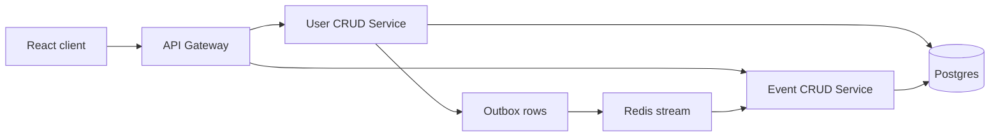

# Microservice architecture

**Date:** 2026-09-22

**Scope:** Split the single FastAPI app into an API Gateway, a User CRUD Service, and an Event CRUD Service. The browser calls the gateway. The gateway calls the services. User lifecycle side effects reach the Event CRUD Service through Redis, not through a direct call. One Postgres database remains. This design replaces the process layout, the public paths, and the user-delete cascade. Event list, bookmark, seen, ticket generation, and update rules stay as in `docs/superpowers/specs/2026-09-21-event-schema-design.md`, except where this document says otherwise.

## Decisions

- The public process is the API Gateway. Traefik publishes only that service. The two domain services listen on the Docker network.
- The User CRUD Service owns users, login, password reset, and email. Directory: `services/user-crud`.
- The Event CRUD Service owns events, venues, performers, tickets, seen links, and bookmark links. Directory: `services/event-crud`. Venue and performer stay tables with no public routes.
- The gateway declares every public route and forwards the path, query, and body unchanged. It does not reshape payloads.
- One Postgres database. Neither service queries the other's tables at runtime. Each service has its own Alembic history.
- User create, display-name change, and user delete publish events. The Event CRUD Service consumes them. The User CRUD Service never calls the Event CRUD Service.
- The public prefix stays `/api/v1`. Paths have no trailing slash. The generated frontend client and Playwright tests follow the new paths.
- `backend/` is removed when the three services run.

## Processes

The browser path is synchronous. A protected handler asks the User CRUD Service to resolve the bearer token, then forwards to the service that owns the route. The client waits for that response.

Purge, seed, and creator refresh are not part of that response. They run when the Event CRUD Service consumes a message. If that service is down, user requests still succeed and the messages wait in Redis.

### Caller

`resolve_token` lives on the User CRUD Service at `POST /internal/resolve-token`. The body is the bearer token. The response is the caller: `id`, `is_active`, `is_superuser`, and `display_name` (`full_name`, otherwise `email`). The gateway does not validate JWTs and does not hold `SECRET_KEY`.

The gateway sends `X-Internal-Key` on every service call. On a protected forward it also sends `X-Caller`, the base64 of the UTF-8 JSON caller. Base64 keeps a non-ASCII display name legal in a header. The body is not wrapped, and the client's `Authorization` header is not forwarded. The User CRUD Service sees the caller's bearer access token only on `POST /internal/resolve-token`. That route is not mounted on the gateway. A missing user, like an invalid token, is `403` with `Could not validate credentials`. An inactive user is `400` with `Inactive user`.

A service answers a bad internal key, or a protected route with no caller, with `401`. Public auth routes and `POST /dev/users` send the key and no caller.

### Shared models

`packages/contracts` holds the public request and response models, the caller object, and the three message payloads. The gateway and both services depend on it by path. SQLModel table classes stay in the service that writes the table.

### Where current code moves

| Current code | Moves to |
| --- | --- |
| `backend/app/api/routes/login.py`, `users.py`, `private.py` | `services/user-crud` |
| `create_user`, `update_user`, `get_user_by_email`, `authenticate` | `services/user-crud` |
| `core/security.py` and the email helpers in `utils.py` | `services/user-crud` |
| `backend/app/email-templates` | `services/user-crud` |
| `deps.get_current_user` | `resolve_token` on the User CRUD Service |
| `backend/app/api/routes/events.py` and `create_event` | `services/event-crud` |
| Venue, performer, ticket, seen, and bookmark tables | `services/event-crud` |
| User table | `services/user-crud` |

`EventPublic.from_event` stops reading `event.owner`. The event row stores `creator`. Create copies it from the caller `display_name`.

Each service gets its own `pyproject` and Dockerfile, taken from the current backend. The image build context is the repo root so the contracts package is available. The gateway image also receives the built frontend.

`packages/react-email` stays where it is. The React app stays in `frontend/`. `VITE_API_URL` points at the gateway.

### Settings

- Gateway: `PROJECT_NAME`, `FRONTEND_HOST`, `USER_CRUD_URL`, `EVENT_CRUD_URL`, `INTERNAL_API_KEY`, `SENTRY_DSN`, `FASTAPI_ENV`. No database, no SMTP, no JWT secret. Forward timeout is 10 seconds, for token resolution and for the forwarded call separately.
- User CRUD Service: the current user, JWT, SMTP, and database settings, plus `REDIS_URL` and `INTERNAL_API_KEY`.
- Event CRUD Service: `DATABASE_URL`, `REDIS_URL`, `INTERNAL_API_KEY`, `SENTRY_DSN`, `FASTAPI_ENV`. No SMTP and no JWT secret.

Both domain services depend on the Redis client library. The gateway does not.

### Startup seed

Today `init_db` creates the first superuser and then Main Hall, The Band, and Opening Night in one process. That splits.

The User CRUD Service startup creates the first superuser when missing and writes a `UserCreated` outbox row in that same transaction. The Event CRUD Service does not read the user table to do this.

On `UserCreated` where `is_superuser` is true, the consumer creates the seed when no venue is named Main Hall:

- Venue Main Hall, Tel Aviv, Israel, seat map `[4, 5, 5, 7]`
- Performer The Band, genre `MUSIC`, description `Live music`
- Event Opening Night, description `First show of the season`, time `2026-10-01 20:00 UTC`, price `25`, owner id and `creator` from that message

A later superuser message does nothing when Main Hall already exists. Any other `UserCreated` does nothing. Using the venue name, which is the check `init_db` uses today, means an event created through the API cannot skip the seed.

## Messages

Redis is a Compose service. One stream, `user-events`. The Event CRUD Service reads it as consumer group `event-crud`.

In the same database transaction as the user insert, update, or delete, the User CRUD Service writes an `outbox` row. The HTTP handler returns when that transaction commits. A loop in the User CRUD Service process appends unpublished rows to the stream and then sets `published_at`. If Redis is down, the user change stands and the loop retries. A crash after the append and before `published_at` can publish twice. Consumers are safe to run twice.

Payloads in `packages/contracts`:

| Message | When | Payload |
| --- | --- | --- |
| `UserCreated` | First superuser, `POST /auth/register`, `POST /users`, `POST /dev/users` | `id`, `display_name`, `is_superuser` |
| `UserUpdated` | `PATCH /users/me` or `PATCH /users/{user_id}` changes the display name | `id`, `display_name` |
| `UserDeleted` | `DELETE /users/me` or `DELETE /users/{user_id}` | `id` |

Password changes publish nothing. Changing `is_active` or `is_superuser` publishes nothing. The next request sees those flags from `resolve_token`. A rejected request writes no outbox row. The superuser self-delete `403` is one of those rejections.

A loop in the Event CRUD Service process reads the stream and acknowledges a message only after its own database transaction commits.

- `UserDeleted` deletes events with that `owner_id`. Tickets and seen and bookmark rows for those events go with the event. It also deletes that user's seen and bookmark rows on other events, and sets `ticket.user_id` to null where it matches.
- `UserUpdated` rewrites `creator` on events with that `owner_id`.
- `UserCreated` follows the seed rule above.

Until a message is consumed, a deleted user can still appear as `owner_id`, and a renamed user can still show the previous `creator`. A newly created event does not wait for a message, because create stores `creator` from the caller.

A failed handler is not acknowledged. On the 5th failed delivery the consumer appends the payload to `user-events-dead` and acknowledges the original.

## Public routes

The gateway strips `/api/v1` and forwards the rest. OpenAPI tags are `auth`, `users`, `events`, and, in development, `dev`. Login is JSON (`email`, `password`) and the spec uses HTTP Bearer. Swagger's OAuth password form is not the login contract. Call `POST /auth/login`, then paste the token.

`GET /health` on each domain service needs no key and only reports that the process is up. `GET /api/v1/health` on the gateway calls both and returns ok only when both answer. Compose and the Docker CI check use the gateway path.

The gateway serves the built frontend at `/` when the build directory is present, as the current backend does. Local development still uses Vite, with `VITE_API_URL` aimed at the gateway.

### Auth

Forwarded to the User CRUD Service. No caller.

| Method | Path | Behavior |
| --- | --- | --- |
| `POST` | `/auth/register` | Public signup. Replaces `/users/signup`. Writes `UserCreated`. |
| `POST` | `/auth/login` | Returns the access token. |
| `POST` | `/auth/password-recovery` | JSON body `email`. The same reply whether or not the address exists. |
| `POST` | `/auth/reset-password` | JSON body `token` and `new_password`. |

### Users

Forwarded to the User CRUD Service. Caller attached.

| Method | Path | Behavior |
| --- | --- | --- |
| `GET` | `/users/me` | Current user. |
| `PATCH` | `/users/me` | Current user. `UserUpdated` when the display name changes. |
| `PATCH` | `/users/me/password` | Current user. No message. |
| `DELETE` | `/users/me` | Current user. `UserDeleted`. |
| `GET` | `/users` | Superuser. List. |
| `POST` | `/users` | Superuser. Create. `UserCreated`. |
| `GET` | `/users/{user_id}` | That user, or a superuser. |
| `PATCH` | `/users/{user_id}` | Superuser. `UserUpdated` when the display name changes. |
| `DELETE` | `/users/{user_id}` | Superuser. `UserDeleted`. |

### Events

Forwarded to the Event CRUD Service. Caller attached. Behavior matches the event schema spec: list newest `created_at` first, bookmarked list, detail marks seen and includes tickets, bookmark, create writes one `AVAILABLE` ticket per seat, update changes `name`, `description`, `time`, and `performer_id`, delete is owner or superuser.

| Method | Path |
| --- | --- |
| `GET` | `/events` |
| `GET` | `/events/bookmarked` |
| `GET` | `/events/{id}` |
| `PUT` | `/events/{id}/bookmark` |
| `POST` | `/events` |
| `PUT` | `/events/{id}` |
| `DELETE` | `/events/{id}` |

### Development only

`POST /dev/users` is mounted when `FASTAPI_ENV=development`. It creates a user with no token, for Playwright, and writes `UserCreated`. It is absent from the production spec. `scripts/generate-client.sh` loads the gateway app with `FASTAPI_ENV=development`, writes `frontend/openapi.json`, and regenerates `frontend/src/client`.

### Removed routes

`POST /login/test-token` (the same data as `GET /users/me`), the password-recovery HTML preview, and `POST /utils/test-email` leave the API. Their helpers are deleted.

## Data

Each service migrates only its own tables. Alembic version tables are `alembic_version_user_crud` and `alembic_version_event_crud`. The gateway has no tables. The old chain in `backend/app/alembic` is deleted with `backend/` rather than split. Each service's first revision creates its tables in their final shape. The two histories do not depend on each other's order. Local and CI databases are recreated empty, then startup seed fills them.

**User CRUD Service** owns `user` and `outbox`. The user row has no relationship to events, seen, or bookmarks. `outbox` stores `id`, `event_name`, a JSON `payload`, `created_at`, and `published_at`. `published_at` stays null until the append succeeds.

**Event CRUD Service** owns `venue`, `performer`, `event`, `ticket`, `eventreadlink`, and `eventbookmarklink`. Foreign keys inside this service stay: event to venue and performer, ticket to event, and both link tables to event. `event.owner_id`, `ticket.user_id`, `eventreadlink.user_id`, and `eventbookmarklink.user_id` are plain UUIDs with no foreign key to `user`. `ticket.user_id` stays nullable.

`event.creator` is a required string on the table the Event CRUD Service creates. Runtime code never reads `user`. There is no backfill: recreated databases have no old event rows, and Opening Night gets `creator` from the `UserCreated` message.

This replaces the event schema spec's rule that deleting a user cascades inside the database. The cascade is the `UserDeleted` consumer. `owner_id` can point at a user who is already gone until that message is consumed.

## Errors

The service that owns a rule returns the status and `detail`. The gateway forwards every `4xx` except `401`. A `401` from a service means the internal key or the caller was rejected, and the client receives `503`. Validation failures stay `422` and are forwarded.

User CRUD Service:

- `400` for a bad login, an inactive account, a wrong current password, a password reused unchanged, and a public signup whose email is taken
- `403` when the caller lacks permission, or a superuser tries to delete themselves
- `404` when the user id is missing
- `409` when an admin create or update hits an email that already exists

Event CRUD Service:

- `404` when the event, venue, or performer is missing
- `403` when the caller is neither the owner nor a superuser
- `400` when ticket creation rejects the payload
- `422` when the body fails validation

Gateway, before forward:

- Invalid or missing token: `403`, detail `Could not validate credentials`
- Inactive account from `resolve_token`: `400`, detail `Inactive user`
- A service cannot be reached, or it rejects the internal key or a missing caller: `503`
- Resolve or forward exceeds 10 seconds: `504`, and a timed-out resolve is not forwarded

A user create, update, or delete returns success once the user row and the outbox row commit. Consumer failure does not change that response.

## Tests and local run

Pytest splits by service.

- User CRUD Service tests call that app directly. Create, display-name change, and delete assert an outbox row. They do not wait for events to change.
- Event CRUD Service tests send the internal key and a caller. `create_event` stays covered there. Consumer tests pass `UserDeleted`, `UserUpdated`, and a first-superuser `UserCreated` into the handler and check the rows. A second delivery changes nothing.
- Gateway tests have no database. They cover an invalid token, an inactive user, `503` when a service cannot be reached or returns `401`, `504` on timeout, and a forward that keeps the body and attaches the caller.

CI starts Postgres, Redis, and Mailpit, migrates both services against `app_test`, and runs the three suites. Coverage fail-under stays 90 for the User CRUD Service and the Event CRUD Service. The single `backend` test job is removed. The gateway suite is required and has no coverage floor.

Playwright uses the gateway. `createUser` calls `POST /dev/users`. Setup logs in as the first superuser and polls `GET /events` until Opening Night is present. No Playwright test treats user-delete as instant event removal. The consumer test covers that purge.

Local Compose runs Postgres, Redis, and Mailpit, then the User CRUD Service (migrate, first superuser, publisher loop), the Event CRUD Service (migrate, consumer loop), the gateway, and Vite.

## Cleanup

Remove `backend/` after nothing imports it: the app, Dockerfile, tests, Alembic tree, and CI steps. Delete the helpers that only existed for `/login/test-token`, the password-recovery HTML preview, and `/utils/test-email`. Regenerate the frontend client from the gateway spec and point call sites at the auth, users, events, and dev paths.
