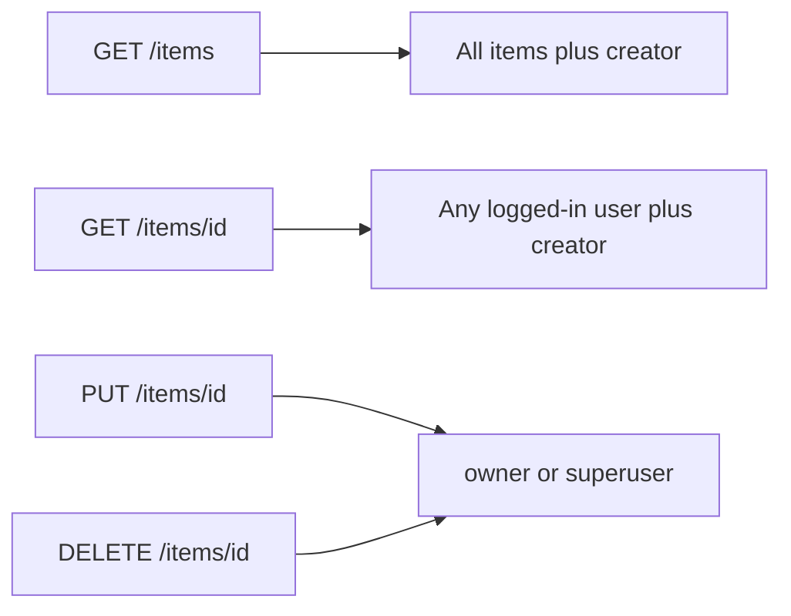

> **Superseded.** The monolith is gone. Public routes live in the contracts catalog. User writes live in `services/user-crud`. Event writes live in `services/event-crud`. Do not follow the steps below.

# Shareable items

Bounded change. No share table, no tokens, no Alembic, **no `GET /users/{id}` change**. Frontend has no SQL. Owner name comes from a **backend join** on `item.owner_id` = `user.id`, returned as `ItemPublic.creator`.

**Using writing-plans + TDD.** On implement, also write [plans/shareable-items.md](plans/shareable-items.md).

## Owner name

`creator = owner.full_name or owner.email`. Not a DB column. Computed in `ItemPublic.from_item(item)` after loading `item.owner` (`selectinload(Item.owner)` on list; relationship on get/create/update).

Do **not** open `read_user_by_id`. Do **not** N+1 from the table.

## Behavior



- List and get: any authenticated user. Drop owner filter on list. Drop GET-item 403 for non-owner.
- PUT/DELETE: **owner or superuser** (keep `if not current_user.is_superuser and item.owner_id != current_user.id: 403`).
- UI: Creator column = `item.creator`. Actions if `owner_id === currentUser.id` **or** `currentUser.is_superuser`.

## Files

- Modify [backend/app/models.py](backend/app/models.py): `ItemPublic.creator: str` and `ItemPublic.from_item(item)`.
- Modify [backend/app/api/routes/items.py](backend/app/api/routes/items.py): list unfiltered; GET no 403; all item responses via `from_item`; eager-load owner on list.
- Modify [backend/tests/api/routes/test_items.py](backend/tests/api/routes/test_items.py) as below.
- Regen client: `scripts/generate-client.sh`.
- Modify [frontend/src/components/Items/columns.tsx](frontend/src/components/Items/columns.tsx), [ItemActionsMenu.tsx](frontend/src/components/Items/ItemActionsMenu.tsx).
- Modify [frontend/tests/items.spec.ts](frontend/tests/items.spec.ts).

Leave [backend/app/api/routes/users.py](backend/app/api/routes/users.py) and `test_users.py` alone.

## Functions

- `ItemPublic.from_item(item: Item) -> ItemPublic`: `creator = (item.owner.full_name or item.owner.email) if item.owner else ""`.
- `read_items`: unfiltered count/select; `selectinload(Item.owner)`; map `from_item`.
- `read_item`: 404 only; `from_item`.
- `create_item` / `update_item` / `delete_item`: PUT/DELETE permissions unchanged; return `from_item` where a body is returned.

# TDD: [backend/tests/api/routes/test_items.py](backend/tests/api/routes/test_items.py)

Write/change test, run, see the **right** failure, then production code. One cycle at a time.

Helpers: `create_random_item(db)` (other user, `full_name` unset so creator = that user’s **email**), `normal_user_token_headers`, `superuser_token_headers`.

Need owner email in tests: `item.owner` after create, or `session.get(User, item.owner_id).email`.

## Cycle 1 — non-owner GET item is 200

Replace `test_read_item_not_enough_permissions` with:

```python
def test_read_item_other_user_ok(
    client: TestClient, normal_user_token_headers: dict[str, str], db: Session
) -> None:
    item = create_random_item(db)
    response = client.get(
        f"{settings.API_V1_STR}/items/{item.id}",
        headers=normal_user_token_headers,
    )
    assert response.status_code == 200
    content = response.json()
    assert content["title"] == item.title
    assert content["description"] == item.description
    assert content["id"] == str(item.id)
    assert content["owner_id"] == str(item.owner_id)
```

- [ ] Write test. Delete old GET 403 test.
- [ ] Run: `cd backend && uv run pytest tests/api/routes/test_items.py::test_read_item_other_user_ok -v`
- [ ] RED: `assert 403 == 200`.
- [ ] GREEN: `read_item` drop 403, keep 404.
- [ ] Re-run: PASS.

## Cycle 2 — normal user list includes others' items

Keep `test_read_items` (superuser). Add:

```python
def test_read_items_includes_other_users_item(
    client: TestClient, normal_user_token_headers: dict[str, str], db: Session
) -> None:
    item = create_random_item(db)
    response = client.get(
        f"{settings.API_V1_STR}/items/",
        headers=normal_user_token_headers,
    )
    assert response.status_code == 200
    content = response.json()
    ids = {row["id"] for row in content["data"]}
    assert str(item.id) in ids
```

- [ ] Write test.
- [ ] Run: `uv run pytest tests/api/routes/test_items.py::test_read_items_includes_other_users_item -v`
- [ ] RED: `str(item.id) in ids` fails (owner-scoped list).
- [ ] GREEN: `read_items` always unfiltered (today’s superuser branch). Delete else.
- [ ] Re-run: PASS.

## Cycle 3 — `creator` on item JSON

Response validation will 500/`ResponseValidationError` until `ItemPublic.creator` exists and routes return it. Assert after GET of another user’s item:

```python
def test_read_item_includes_creator_name(
    client: TestClient, normal_user_token_headers: dict[str, str], db: Session
) -> None:
    item = create_random_item(db)
    owner_email = item.owner.email if item.owner else db.get(User, item.owner_id).email
    response = client.get(
        f"{settings.API_V1_STR}/items/{item.id}",
        headers=normal_user_token_headers,
    )
    assert response.status_code == 200
    assert response.json()["creator"] == owner_email
```

(`create_random_user` sets no `full_name`, so creator is email. Optional later: one test with `full_name` set.)

- [ ] Write test.
- [ ] Run: RED — missing `creator` (422/500 or KeyError) or field absent.
- [ ] GREEN: `ItemPublic.creator` + `from_item`; wire list/get/create/update; `selectinload(Item.owner)` on list.
- [ ] Also assert `creator` on `test_create_item` / `test_read_item` if those responses go through `from_item`.
- [ ] Re-run cycle 3 + full file: PASS.

Use `db.get` vs `session.get` as this codebase does (`session.get`). Fix the snippet to `from app.models import User` and `db.get(User, item.owner_id)` if `item.owner` is expired.

## Leave unchanged (write rules)

| Test | Stays |
| --- | --- |
| `test_update_item` | Superuser PUT other owner **200** |
| `test_delete_item` | Superuser DELETE other owner **200** |
| `test_update_item_not_enough_permissions` | Normal user PUT **403** |
| `test_delete_item_not_enough_permissions` | Normal user DELETE **403** |
| not-found tests | Same |

- [ ] `uv run pytest tests/api/routes/test_items.py -v` all green.

# UI (after API green)

- [ ] `bash scripts/generate-client.sh` so `ItemPublic.creator` exists.
- [ ] Column `accessorKey: "creator"`, header `"Creator"`.
- [ ] `ItemActionsMenu`: `useAuth()`. Return `null` if not owner and not `is_superuser`.
- [ ] Playwright: user A creates item; user B sees title and creator (A’s email/`full_name`); B has no ⋮. Owner edit/delete stay.

## Skip

Share invites, visibility flags, username column, Alembic, opening `GET /users/{id}`, frontend user fetches.

## Verify

`uv run pytest tests/api/routes/test_items.py -v`. Playwright items spec. Browser: two accounts, shared list, creator names, only owner and superuser see ⋮.
